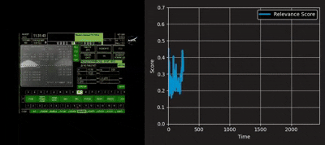

# Official implementation of paper: *Aha! – Predicting What Matters Next: Online Highlight Detection Without Looking Ahead (in Proceedings of NeurIPS 2025)*

<div align="center">
    
    <p></p>
</div>


## Contents:
- [Introduction](#introduction)
- [Installation](#installation)
- [Required Specs](#required-Specs)
- [Inference](#inference)
- [Preparing the metadata](#preparing-the-metadata)
- [Evaluation](#evaluation)
- [Training](#training)
  - [Distributed Training](#distributed-Training)
- [Fine-tuning](#fine-tuning)
- [Usage Guidelines](#usage-guidelines)
- [Acknowledgements](#acknowledgements)
- [License](#license)
- [Citation](#citation)

# Introduction


Unlike traditional models that analyze every frame or respond at fixed intervals, Aha! dynamically decides when to pause, reason, and act, capturing the essence of meaningful moments.

Built by fine-tuning Qwen-7B with a multimodal, importance-aware objective and incorporating uncertainty-based decision-making, Aha! can:
- 🎯 Detect when enough context has accumulated to make informed predictions

- 📊 Rank and extract key segments using task-aware importance scores

- 📝 Generate structured highlight reels using Savitzky-Golay smoothing and time-domain peak detection to identify key moments.

This approach enables more efficient video understanding, making Aha! applicable to autonomous agents, surveillance, video summarization, and decision-support systems. This is an example of our model running live on the [NASA Stream of Astronaut Jonny Kim Soyuz MS-27 Docking (55 minutes of video)](https://www.youtube.com/watch?v=b7Kk4r9DomA):


<div align="center">
    
    <p></p>
</div>


# Installation
1. Create conda environment and use pip to install some packages
```shell
cd aha
conda create -n aha python=3.10
conda activate aha
pip install --upgrade pip
pip install -r requirements.txt
```


2. Install llava. If you run into any issues check the [official repository download instructions.](https://github.com/LLaVA-VL/LLaVA-NeXT)
```bash
cd LLaVA_NeXT
pip install -e ".[train]"
cd ..
```
3. Install torch compiled with cuda. Install them together using the instructions provided by [pytorch.org](https://pytorch.org).

4. Install flash-attention following the instructions in [https://github.com/Dao-AILab/flash-attention](https://github.com/Dao-AILab/flash-attention). If you have difficulties installing it, add `--attn_implementation sdpa` in every command to use the sdpa implementation of transformer attention for train or inference.
```bash
MAX_JOBS=4 pip install flash-attn --no-build-isolation --no-cache-dir 
```

5. Optional: you can download the weights of the model from [our google drive](https://drive.google.com/file/d/1ivpu0W23dis3UwUGemNWCnPMol0ubHfr/view?usp=sharing)


<details>
<summary> Common Problems </summary>

*Note 1:* If you get a `bitsandbytes` error, try running:
```bash
pip uninstall bitsandbytes
pip install bitsandbytes
```
*Note 2:* If you get a `Undefined symbol cpython-310-x86_64-linux-gnu.so: undefined symbol:` error, try running:
```
pip uninstall flash-attn
pip install flash-attn --no-build-isolation --no-cache-dir
```
*Note 3:* If you get some kind of `c10 deprecation` error, your pytorch version might be too high. The authors used the version:
- `Python==3.10`
- `torch == 2.5.1`
- `torchvision==0.20.1`
- `cuda12.4`

```bash
pip3 install torch==2.5.1 torchvision==0.20.1 torchaudio --index-url https://download.pytorch.org/whl/cu124
```

*Note 4:* If you want to use the CPU adam optimizer with deepspeed, you need to install it with the correct flags:
```bash
DS_BUILD_CPU_ADAM=1 DS_BUILD_UTILS=1 \
pip install deepspeed \
  --global-option="build_ext" \
  --global-option="-j8"
```
</details><br>

# Required Specs
This model trained 1 epoch off of 6xA6000 GPUs, over 24 hours. You need at least 48GB worth of VRAM on each GPU to tune it.

Inference requires at least 24GB VRAM. Tested on a single RTX 4090 GPU. 


## Download pretrained Model
- Download checkpoint weights from our [google drive](https://drive.google.com/file/d/1ivpu0W23dis3UwUGemNWCnPMol0ubHfr/view?usp=sharing) 
- Unzip the weights into `aha_weights`
  ```bash
  unzip aha_weights.zip -d aha_weights
  ```


# Preparing the metadata
- Download the metadata for our dataset. You can download them from our [google drive](https://drive.google.com/file/d/1XaZyaPC2Fi7n9YhQuUzYh62npfEcDGhF/view?usp=sharing). 
- Unzip the weights into `datasets`
  ```bash
  unzip datasets.zip -d datasets
  ```

This should give you a structure like this.


```
├── datasets
│   ├── charades
│   │   └── annotations
│   │       └── test-random_prompt.json
│   ├── coin
│   │   └── annotations
│   │       └── train-0.25_0.5_earlier-120s_240s.json
│   ├── download_tools
│   │   ├── coin_download.py
│   │   ├── coin_files.json
│   │   ├── hisum_download.py
│   │   ├── mr_hisum_crawler.py
│   │   ├── mr_hisum_metadata.csv
│   │   └── vocabulary.csv
│   ├── hisum
│   │   └── annotations
│   │       ├── mr_hisum_metadata.csv
│   │       └── split.json
│   ├── HIHD
│   │   └── annotations
│   │       ├── HIHD_metadata.csv
│   │       ├── youtube_links.txt
│   ├── shot2story
│   │   └── annotations
│   │       ├── dvc_train-human_anno-0.25_0.5_earlier.json
│   │       ├── magqa_test.json
│   │       └── magqa_train-0.25_0.5-earlier.json
│   ├── tvsum
│   └── youcook2
│       └── annotations
│           └── val-random_prompt.json
├── assets
├── configs
├── data
├── demo
├── instructions
├── LICENSE
├── LLaVA_NeXT
├── models
├── README.md
├── requirements.txt
├── scripts
├── test
├── train.py
└── Utils
```


# Evaluation

- Tvsum data preparation:
  - Follow the instructions from the official [tvsum](https://github.com/yalesong/tvsum?tab=readme-ov-file) repository to download the videos then move it to the datasets folder as `datasets/tvsum`
  - Run `scripts/inference/tvsum.sh`.
  - To evaluate tvsum with the quality dropout, run `scripts/inference/tvsum_degraded.sh`

- Mr.Hisum data preparation
  - Prepare the `mr_hisum.h5` file following the instructions of the [official repository](https://github.com/MRHiSum/MR.HiSum). 
  - Place the `mr_hisum.h5` file in the `datasets/hisum/annotations` folder.
  - Download the validation youtube videos and place them in the `datasets/hisum/videos` folder.
  - Run `scripts/inference/hisum.sh`

- Charades data preparation
  - Prepare the Charades videos following the [official instructions](https://prior.allenai.org/projects/charades). Place them in `datasets/charades/videos` folder.
  - Run `scripts/inference/charades.sh`

- YouCook2 data preparation
  - Prepare the youcook2 videos following the [official instructions](https://opendatalab.com/OpenDataLab/YouCook2). Place them in `datasets/youcook2/videos` folder.
  - Run `scripts/inference/youcook2.sh`

- Shot2Story data preparation
  - Prepare the shot2Story videos following the [official instructions](https://huggingface.co/mhan/shot2story-videos). Place them in `datasets/shot2story/videos` folder.
  - Go to `scripts/inference/magqa.sh` and update the `GROQ_API_KEY` (if using online inference for llama-3.3 70B) and `OPENAI_API_KEY` (required).
  - **Note:** You need at least 140GB of VRAM locally to run a quantized version of a 70B llama model. 
  - Run `scripts/inference/magqa.sh`


# Training

## Data preparation
- HIHD data preparation
  - Download the train youtube videos and place them in the `datasets/HIHD/videos` folder.
  - All youtube videos are listed in [datasets/HIHD/annotations/youtube_links.txt](datasets/HIHD/annotations/youtube_links.txt)
- Shot2Story data preparation
  - Prepare the shot2Story videos following the [official instructions](https://huggingface.co/mhan/shot2story-videos). 
  - Place them in `datasets/shot2story/videos` folder.
- COIN data preparation
  - Prepare the COIN videos following the [official instructions](https://coin-dataset.github.io/).
  - Place the videos in the `datasets/coin/videos` folder.


Since some of these datasets (especially HIHD) are very big, you can always specify the video path in the `configs/datasets/aha_config.json` file where the datasets exist on your local machine.  

*note:* I've left a script to help the download processes at `datasets/download_tools`

When running training code for the first time, the dataset code will traverse all videos of the training dataset and measure the frame rate, duration, number of frames, and the corruption status of the videos. It will store this information in `datasets/${dataset_name}/videos_metadata.json`. This can take some time, since some of these datasets are very large.

- Following MMDuet's labeling process, download [paraphrase-en.gz](https://github.com/lichengunc/refer/raw/refs/heads/master/evaluation/meteor/data/paraphrase-en.gz) (59MB) which is used for dense video captioning evaluation. Put this file at `test/dvc/metrics/data/paraphrase-en.gz`


## Run the training script
Log into wandb in order to monitor your progress
```bash
wandb login [YOUR_API_KEY]
```

Start the training process
```bash
bash ./scripts/train.sh
```

## Distributed Training
This model is very big, trained on 6xA6000 GPUs, and you will probably need to utilize distributed training. [I've included instructions on how to train on the cloud, using Paperspace.](instructions/distributed_instructions.md)

# Fine-tuning

If you wish to further tune the trained weights, download the pretrained model from our [google drive](https://drive.google.com/file/d/1ivpu0W23dis3UwUGemNWCnPMol0ubHfr/view?usp=sharing) and put the files under folder `aha_weights`

In the `scripts/train.sh` file, add this line:
```--lora_pretrained aha_weights  \```


# Usage Guidelines

This model should not be deployed in contexts that may infringe on personal privacy or be used to reinforce harmful societal biases. If used in sensitive domains (e.g., surveillance, defense), additional safeguards such as privacy-preserving filters, access controls, and domain-specific audits are strongly recommended. By using this model, you agree to adhere to responsible AI deployment practices.


# Acknowledgements
ANONYMOUS


# License


This project is licensed under the [Apache License 2.0](LICENSE).

# Citation
If you find this work useful in your research, please consider citing:

ANONYMOUS
